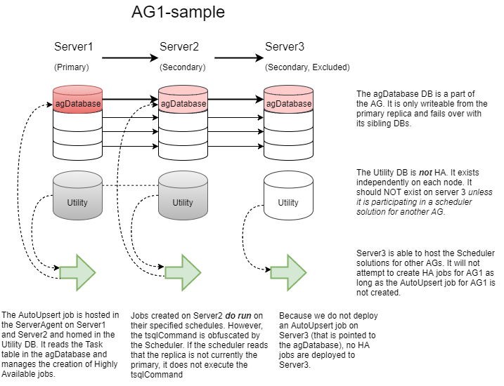

Jump To [Uninstallation](#uninstallation) | [DEV Installation](#development-installation)

# Deployment

Deploying to an AG follows the below footprint. 



Examples herein assume we have a two node cluster (`primaryNode`, `secondaryNode`) which hosts an AG that is primary/secondary on the respectively named nodes, containing a database called `agDatabase`.

For a two-replica AG, the scheduler solution is deployed 3 times (number of replicas plus 1), and two auto-upsert jobs are created.

##### `agDatabase`
- Contains the scheduler schema deployed in AG mode
- Contains no tasks by default
- Contains a stored procedure that creates an agent job on the current instance based on tasks in the task table

##### `primaryNode`, `secondaryNode`
- Contains the scheduler schema deployed in standalone mode
- Contains a single task (and linked agent job) which will periodically call the upsert procedure in `agDatabase`

Key here is that the two standalone deployments will both periodically call into `agDatabase` and invoke the upsert stored procedure, creating agent jobs for that AG on both nodes.  Note that this requires the AG to have readable secondaries.

## 1.1 (Manual) Deployment

In release 1.1, deployment occurs by executing powershell commands from the Module explicitly against the target servers & databases with the appropriate `$agMode` flag for the instance. 

### Availability Group Mode

- Clone the repository
- Open a powershell session and change to the src folder
- Import the powershell module that contains the install scripts
- Deploy the solution in AG mode against a database in the AG
- Deploy the solution in standalone mode against every instance which can host the primary replica (not in an AG database)
- Deploy the AutoUpsert task on all nodes which can host the AG
  - The notify operator must exist on the instance or the job will not be created
- Deploy the UpdateReplicaStatus job against the AG solution

```powershell
Import-Module .\Modules\tsqlscheduler

# Deploy once in AG mode
Install-SchedulerSolution -Server primaryNode -Database agDatabase -agMode $true -AvailabilityGroup AGName

# Deploy once potential primary per-node in standalone mode (needed once per node only, not once per AG)
Install-SchedulerSolution -Server primaryNode -Database Utility -agMode $false
Install-SchedulerSolution -Server secondaryNode -Database Utility -agMode $false

# Create the job on every node that can host the primary
Install-AutoUpsertJob -Server primaryNode -Database Utility -TargetDatabase agDatabase -NotifyOperator "Test Operator"
Install-AutoUpsertJob -Server secondaryNode -Database Utility -TargetDatabase agDatabase -NotifyOperator "Test Operator"

# Create the job that keeps track of the replica status
Install-ReplicaStatusJob -Server primaryNode -Database agDatabase -NotifyOperator "Test Operator"
```

In an instance hosting multiple availability groups, the `Utility` database needs to contain one `AutoUpsert` task for every AG.

If the Utility database on each instance is going to be used to schedule instance tasks (rather than just the tasks in `agDatabase`) an additional pair of tasks would be required:

```powershell
Install-AutoUpsertJob -Server primaryNode -Database Utility -TargetDatabase Utility -NotifyOperator "Test Operator"
Install-AutoUpsertJob -Server secondaryNode -Database Utility -TargetDatabase Utility -NotifyOperator "Test Operator"
```

### Standalone (Instance) Mode

- Clone the repository
- Open a powershell session and change to the src folder
- Import the powershell module that contains the install scripts
- Deploy the solution in standalone mode against the target instance
- Deploy the AutoUpsert task on the instance
  - The notify operator must exist on the instance or the job will not be created.

```powershell
Import-Module .\Modules\tsqlscheduler

# Deploy in standalone mode
Install-SchedulerSolution -Server primaryNode -Database Utility -agMode $false
Install-AutoUpsertJob -Server primaryNode -Database Utility -TargetDatabase Utility -NotifyOperator "Test Operator"
```

# Development Installation 

If you have Development environment that is not a member of an AG, you may force execution of tasks in this environment by updating the [`GetCachedAvailabilityGroupRole()`](../src/Functions/GetCachedAvailabilityGroupRole.sql#L15) function to `return coalesce(@role, N'PRIMARY');`. This is the minimum surface area change to force execution in a non-AG environment meant to mimic a production AG installation.

# Uninstallation

Server objects can be removed with the [RemoveAllObjects](../src/RemoveAllObjects.sql) SQL script.  Note that this will remove the objects but not any SQL Agent jobs which have been created.

## AG Mode Removal

After importing the module, you can execute the Powershell command `UnInstall-SchedulerSolution` and specify the Server and Database to remove all objects including Agent Jobs. Schedulers for other AGs on these replicas should remain unaffected by this unless you've done something funky (like setting this AG's HADB as the local anchor for another AG :grimacing:). 

## Local Installation Removal

After importing the module, you can execute the Powershell command `UnInstall-SchedulerSolution -agMode $false`. You will be prompted for the name of the server and database on which you wish to remove the scheduler. 

 