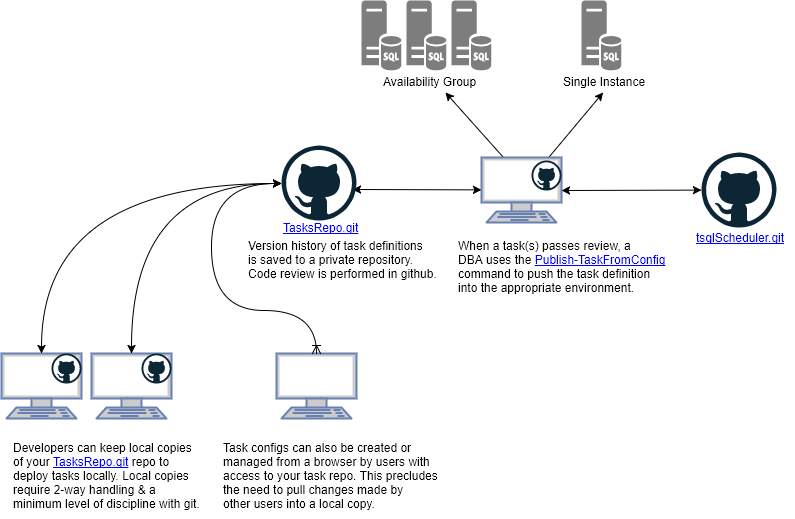

# Task Config

All non-informative/sample objects in this directory are ignored by default. You may clone your own repository to this location and provide a versioned history of tasks that may be more friendly to developers. The json config files for each task may be deployed to an installation using the following Powershell command

```powershell
$configFile = "./AG1-sample/Sample_Task.task.json"
$srv = Server1
$db = Utility

Publish-TaskFromConfig -config $configFile -Server $srv -Database $db
```

> The naming convetion for task files is `Identifier.task.json`.

The config files can be generated from pre-existing rows in the database by querying the [`TaskConfig`](../../src/Views/TaskConfig.sql) view. However, extracting via this method will provide a one-line/non-prettified json blob. 

Managing your tasks in this way provides for simplified management of parity between development & production environments. For example, if you wished to deploy tasks from your production installation to a new development installation on which lesser privileged programmers have permissions to deploy so they may test scripts prior to requesting code review & promotion to production - you could do so by navigating to the `/AG1-sample` folder and executing the following... (remember to check that the requisite Operators exist on the new server)...

```powershell
$srv = "SQL-Dev-1"
$db = "Utility"
$tasks = Get-ChildItem -Filter *.task.json | Select Name

foreach($t in $tasks){
    Publish-TaskFromConfig -config $t.Name -server $srv -Database $db
}
``` 

Hey presto, you've now copied all the tasks in this repo to your dev server! :grin: 

## Managing Tasks with Developers



Using config-based deployment & keeping a separate repository for your task configs allows you to extend task management to developers and other users without over-privileging. Keep your tasks in private repository and allow users to open a PR when they wish to add/update/delete tasks. Deployment to targeted environments is still bottleneck through an appropriately-permissioned connection. 

### But what if a highly-privileged ne'er-do-well edits tasks outside my config repo?! :scream:    

As noted above:

> The config files can be generated from pre-existing rows in the database by querying the [`TaskConfig`](../../src/Views/TaskConfig.sql) view. However, extracting via this method will provide a one-line/non-prettified json blob.

You can update your config repo based on the task state in the DB using a method similar to the below:

```powershell
$srv = "SQL-Dev-1"
$db = "Utility"
$fPath = "c:\git\my-tasks\"
$getTasksQ = @"select * from scheduler.TaskConfig;"@ # or customize as prefered  

$allTasks = (Invoke-Sqlcmd -ServerInstance $srv -Database $db -Query $getTasksQ)

foreach($t in $allTasks){
    $fName = $t.Identifier
    $fName = "$fPath\$fName.task.json"
    
    $config = $t.Config

# the json comes out of the DB un-prettified, this helps  
    $config= ($config | ConvertFrom-Json | ConvertTo-Json)

    Set-Content -LiteralPath $fName -Value $config 
}
```

Optionally you can also hard-delete old tasks. Do this only **after** publishing the deletion to all environments by appending the below snippet to the above script.

```powershell
# delete from disk tasks that have been deleted in DB
$onDiskTasks = (Get-ChildItem $fPath -Filter "*.json")

$onDiskTasks | Where-Object {
    ($_.Name).Replace(".task.json","") -notin $allTasks.Identifier
} | Remove-Item
```